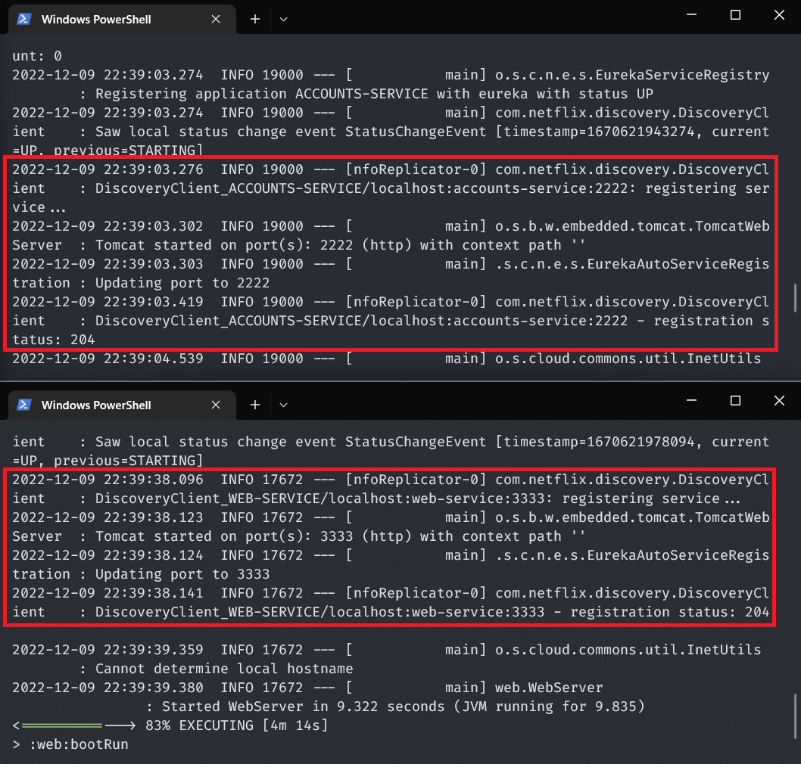
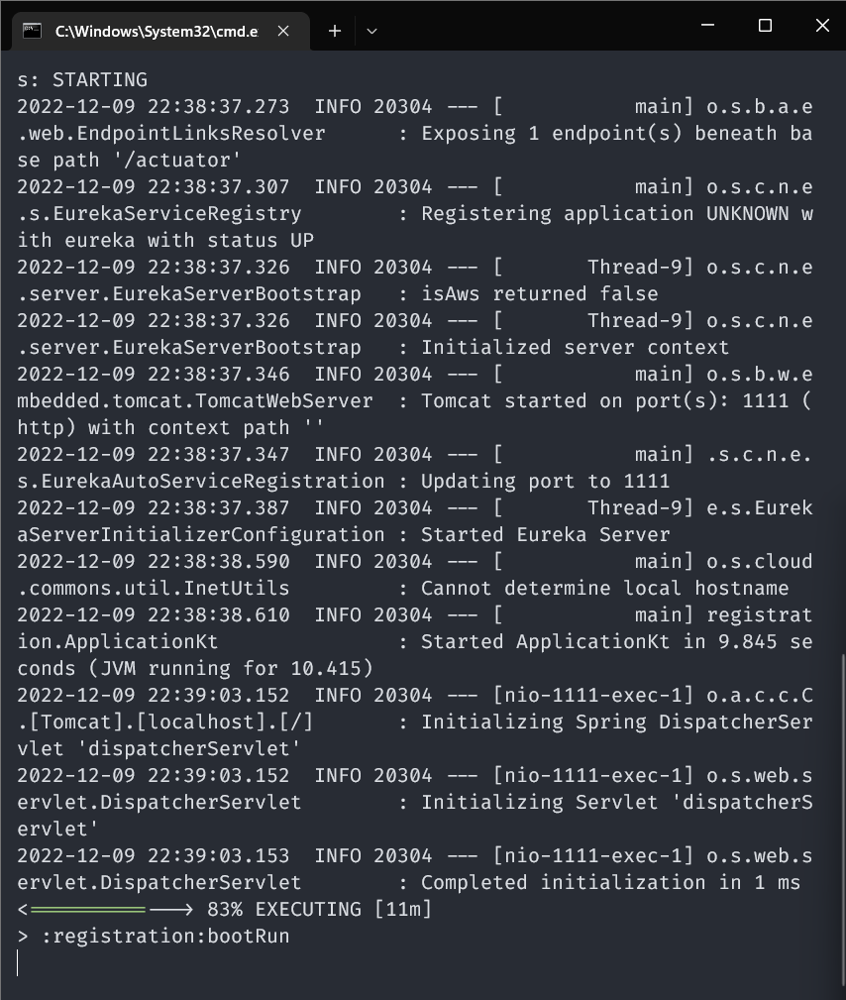
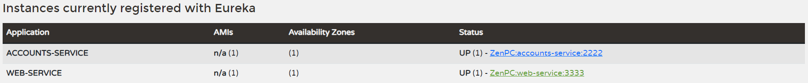
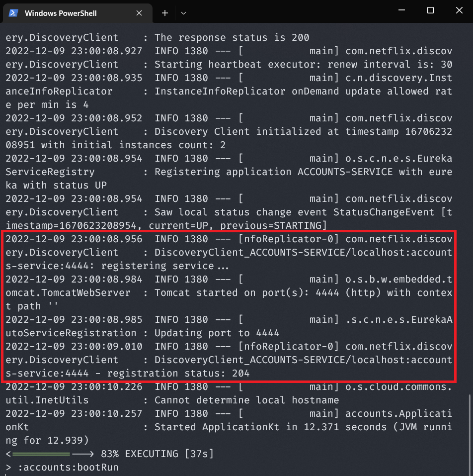
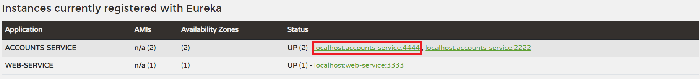
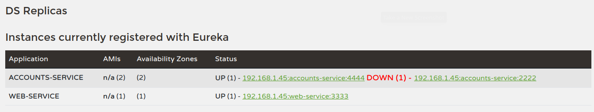
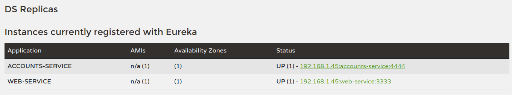
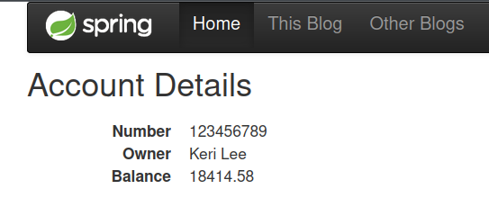

# Lab 6 report

## Services are registered
The following screenshots show that both services (`accounts` and `web`) up and running, as well as registered to the discovery service. 
The highlighted area shows the registering request and the success status code, which is 204 (no content).

## Registration service logs

The Eureka service is running too, the dashboard at `localhost:1111` shows both services
are registered as well.

## Adding another account service
A new account service at `localhost:4444` is launched and registered into the Eureka discovery service.

The dashboard now shows that 2 account services are registered:

## Turning one account service instance down
The account service at `localhost:2222` has been turned down, the eureka registration service frontend inmediately shows that the instance is down.

When the default expiration timeout passes, Eureka unregisters the turned-off service.

If we try to get information about the accounts, there won't be any errors, since the logical domain assigned to the account microservice instance
still has one instance bound to it. As long as there's one instance bound to the logical domain for the account service, the 
registration will round-robin the requests across all active and bound instances.

